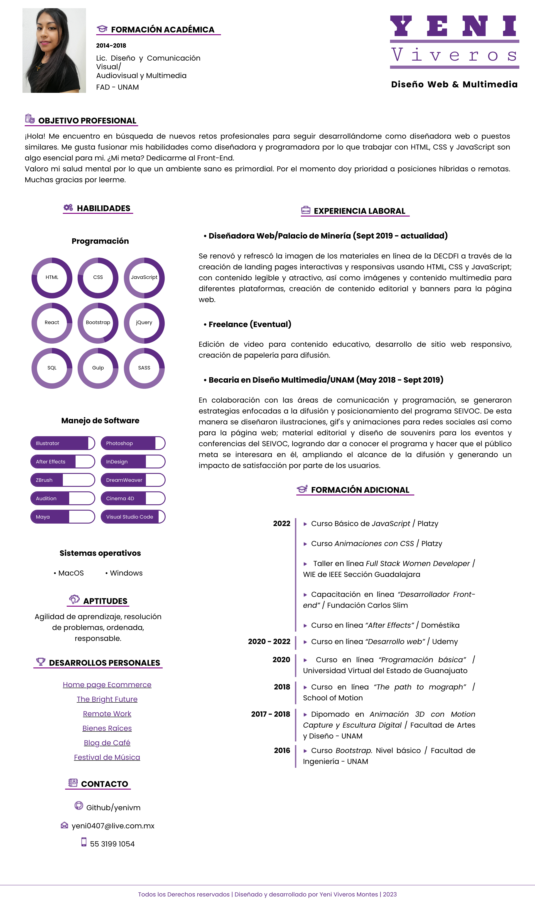

# Curriculum Vitae - Yeni Viveros Montes

¡Hola! Me llamo Yeni y actualmente soy Diseñadora Web, desarrollo landing pages animadas y responsivas con HTML, CSS y JavaScript.
Te invito a visitar mi Curriculum Vitae, diseñado y desarrollado por mi. Aún faltan algunas cosas por mejorar, siéntete libre de hacerme llegar tus críticas constructivas, me sirven mucho de ayuda.

## Table of contents

- [Introducción](#introducción)
  - [Resultado](#resultado)
  - [Links](#links)
- [Mi proceso](#mi-proceso)
  - [Lenguajes](#lenguajes)
  - [Mejoras](#mejoras)
- [Autor](#autor)

## Overview

### Resultado

### Links

- Live Site URL: [Github pages](https://yenivm.github.io)

## Mi proceso

### Lenguajes

- Semantic HTML5 markup
- CSS custom properties
- Flexbox
- CSS Grid
- Mobile-first workflow
- JavaScript

### Mejoras

Continuaré mejorando tanto el diseño como el desarrollo no solo de mi currículum, sino de proyectos futuros. En este caso hay algunos elementos en HTML que se pueden inyectar desde JavaScript y que se pueden implementar todavía más a través de React, pero aún me falta pulir algunas herramientas para lograr llegar a eso.

## Autor

- LinkedIn - [Yeni Viveros Montes](https://www.linkedin.com/in/yeni-viveros-montes)

